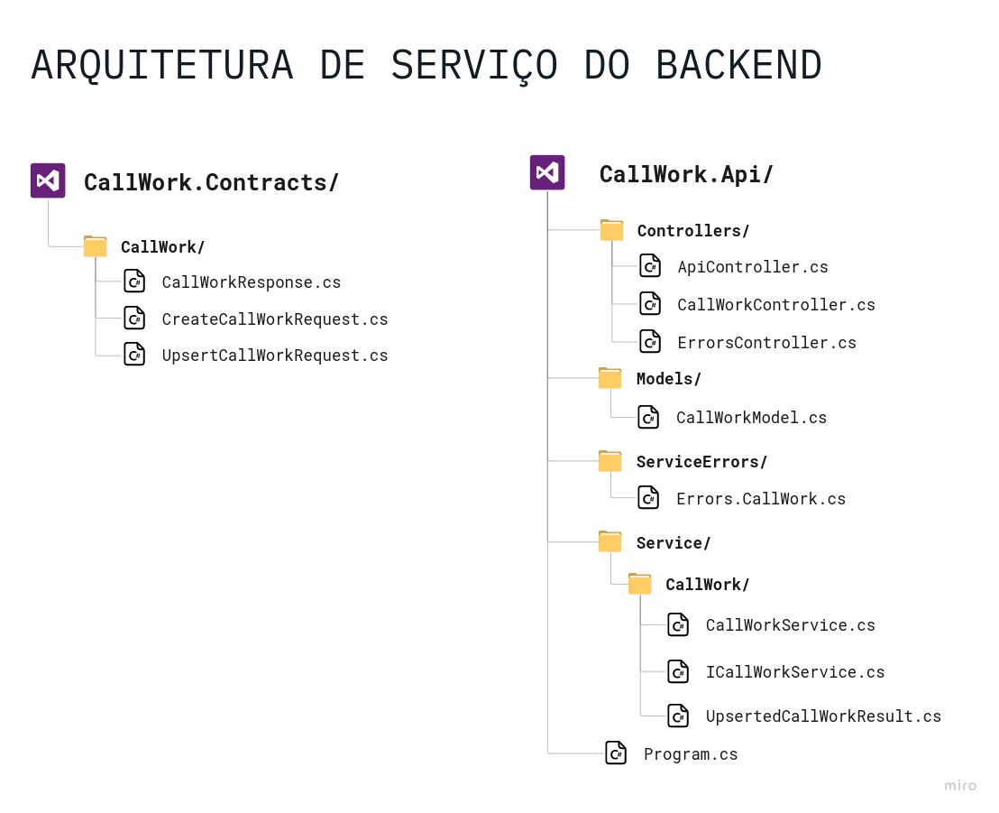

# Call Work

- [Visão Geral](#visão-geral)

- [Arquitetura de Serviço](#arquitetura-de-serviço)

- [Tecnologias]("#tecnologias")

- [Arquitetura]("#arquitetura") [Uso]("#uso")

- [Aviso]("#aviso") [Licença]("#licença")

# Visão geral

## Descrição

Call Work é uma aplicação com o objetivo de conectar estudantes de engenharia de
software que estejam buscando colaboração tanto para construção de seus próprios
projetos, quanto para auxílio no estudo de um tema específico.

O back-end é construído no padrão REST e suporta operações de leitura, escrita,
atualização e exclusão (CRUD) de agendamentos de eventos criados por estudantes
que desejam colaboração ou compartilhar conhecimento.

# Arquitetura de Serviço

 

# Tecnologias

- ASP.NET 6
- Dotnet CLI
- Visual Studio Code

# Escolhas de padrões Arquiteturais

- CRUD REST API
- DDD (🤏) 

# Uso

```
git clone git@github.com:dvths/call-work.git

dotnet run --project CallWork.Api

```

# Aviso

Este é um projeto de estudo em constante refatoração conforme meus estudos em
desenvolvimento .NET avançam com intuito de exercitar a construção de uma api
REST de nível industrial.

# Licença

MIT
